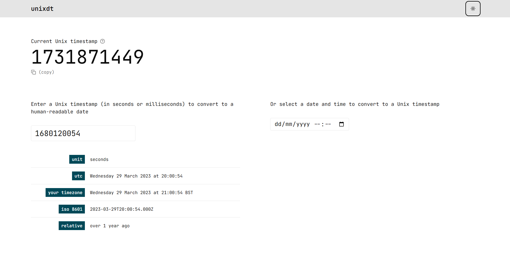

# unixdt (Unix datetime)

A super simple [Remix](https://remix.run/) app that converts Unix timestamps to dates, and vice-versa.

<picture>
    <source media="(prefers-color-scheme: dark)" srcset="./.github/images/screenshot-dark.png">
    
</picture>

## Self-hosting

This project has been configured to be deployed to Vercel. However, it's fairly easy to deploy it anywhere else. Here's how to deploy it your own Node.js server:

1. Fork this repo and clone the fork locally:
   ```sh
   git clone https://github.com/<your-username>/unixdt
   ```
2. Install dependencies
   ```sh
   npm install
   ```
3. Replace all usages of `@vercel/remix` with `@remix-run/node`.
   - You can uninstall `@vercel/remix` at this stage
4. Build the app:
   ```sh
   npm run build
   ```
5. Start the app:
   ```sh
   npm start
   ```
6. Configure your server to serve requests (e.g., using [nginx](https://nginx.org/)) from the port _unixdt_ is running on.

> [!TIP]
> Use a process manager like [pm2](https://pm2.keymetrics.io/) to keep your app running on your server.
